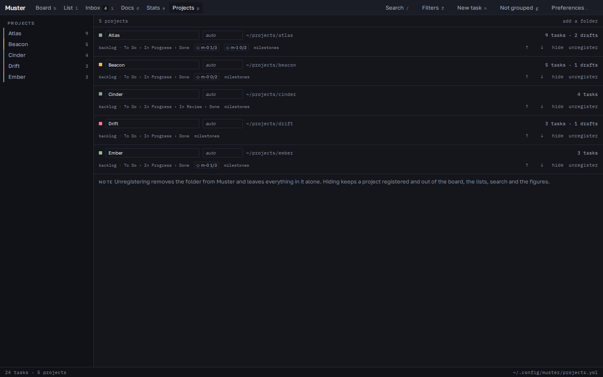
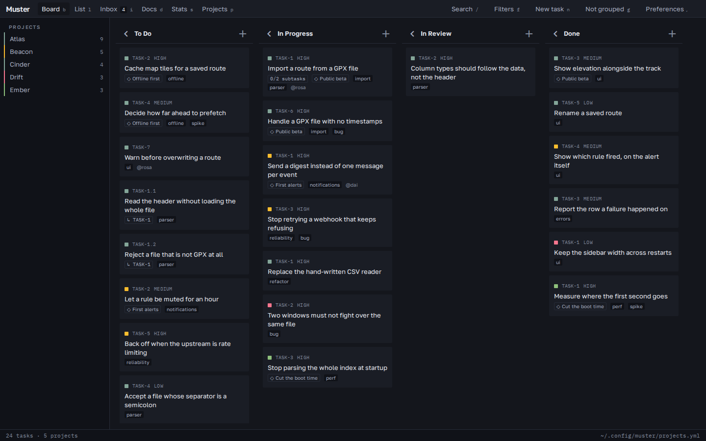
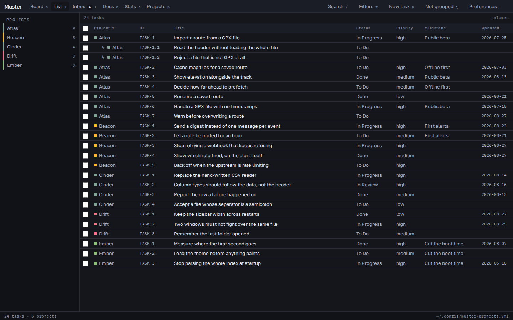
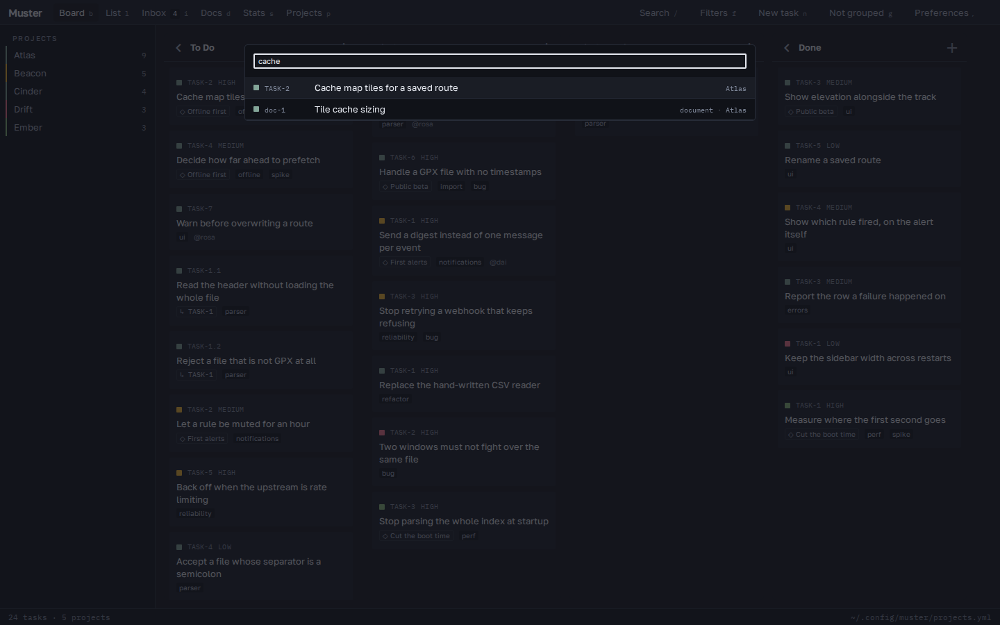
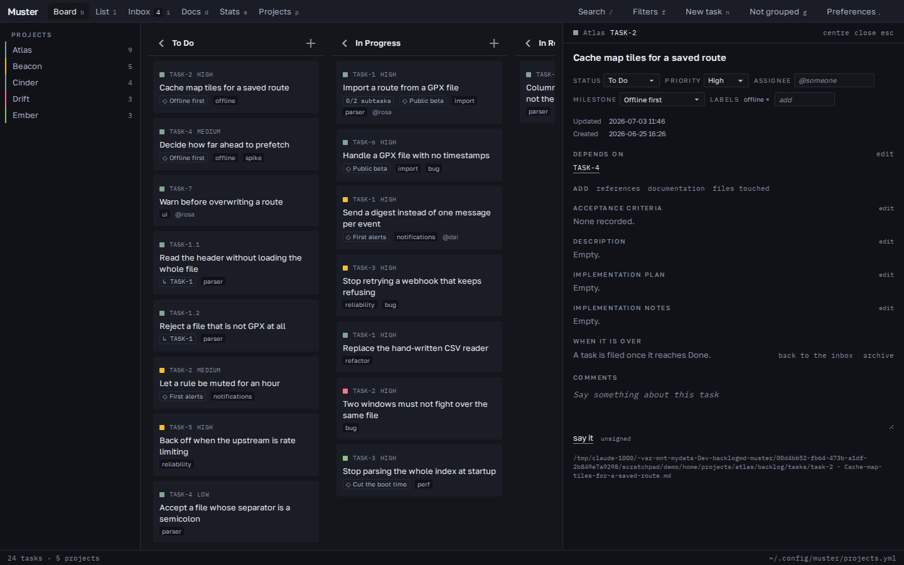
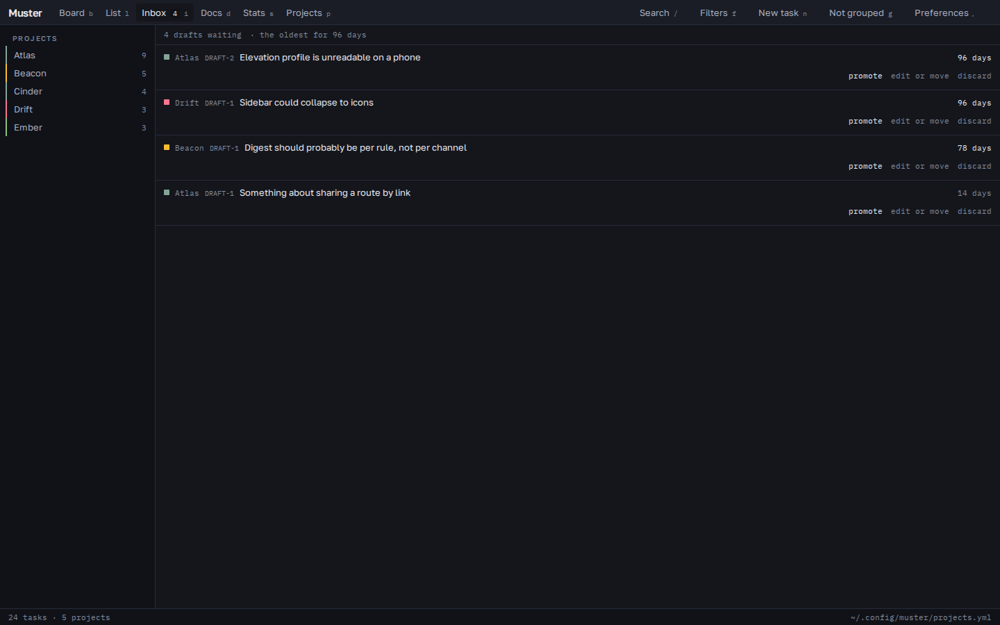
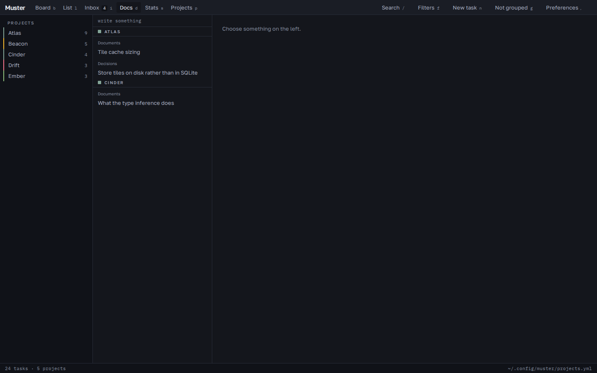
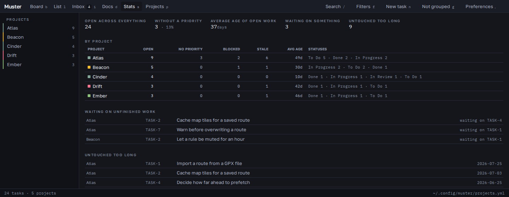

Everything Muster does, screen by screen. The screenshots are of five invented projects — Atlas, Beacon, Cinder, Drift and Ember — because a guide illustrated with somebody's real planning is a guide that cannot be published.

Every screen has a key: `b` board, `l` list, `i` inbox, `d` documents, `s` figures, `p` projects. `/` searches, `f` filters, `n` writes a new task, `g` cycles grouping, `,` opens preferences, `Escape` closes whatever is open.

## The registry

Muster has no idea where your projects are until you tell it. The list lives in one file:

```
~/.config/muster/projects.yml
```

```yaml
projects:
  - path: ~/projects/atlas
    name: Atlas
  - path: ~/projects/beacon
```

`path` is the only required field. `name` overrides what the project calls itself, and `colour` pins a project's hue instead of letting one be derived from its path. The file is yours: Muster rewrites it while keeping your comments and ordering, and never expands the `~` you wrote.

Nothing has to be edited by hand, though. **Projects** (`p`) adds a folder with the system's own directory chooser, and it tells you before you commit to it whether the folder is already a Backlog.md project, whether it can be initialised as one, or whether it is unsuitable and why.



Each row shows where the project is, what it holds, and the statuses it declares — Cinder's are not the others'. A project can be renamed, recoloured, reordered, hidden or unregistered here. **Hiding** keeps it registered and takes it out of the board, the lists, search and the figures, which is the thing to reach for when one repository is noisy this week. **Unregistering** removes the folder from Muster and leaves everything in it exactly as it was.

## The board



Columns are the union of the statuses every registered project declares, in an order derived from them. A card can only be dropped into a column its own project has: Cinder is the only project above with `In Review`, so a card from Atlas dropped there is refused with the reason rather than silently moved.

A move is written by the `backlog` CLI and the board then settles on whatever the files say — never on where the card landed. That is why a failed write is visibly harmless: the card returns to where the files still put it.

Dropping a card within a column sets its manual order, taking the ordinal between its new neighbours. Where the gaps run out the column is restacked at multiples of 1000, which is the allocation Backlog.md uses itself.

`g` cycles the grouping: nothing, by project, by milestone. The open edition of the board widget has no swimlanes, so grouping is expressed as ordering — cards clump instead of interleaving, which over five projects is the difference between reading a column and scanning it.


## The list



The mode for scanning many tasks rather than moving a few. Every column sorts, the visible set of columns is remembered across restarts, and a subtask sits under its parent instead of sorting away from it — the sort still decides the top-level order, and a subtask whose parent is filtered out keeps its own place rather than disappearing with it.

Ticking rows changes many at once. Shift extends a range from the last box clicked, the box in the header takes everything shown, and one form then describes the change once: status, priority, milestone, labels to add and labels to remove. Every write still goes through the CLI one task at a time, so the result says how many took the change and names every one that did not.

Status and priority are offered as the intersection of what every chosen project configures, so the form cannot offer a value half the selection would reject. A milestone is not offered across projects at all — ids belong to one project, and `task edit -m` accepts an id the project does not have without complaining.

## Search



`/` searches tasks, drafts, documents, decisions and milestones across every registered project at once. A hit opens where it belongs: a task in the panel, a document in the viewer.

**Filters** (`f`) narrow the board and the list together by status, priority, type, label and milestone, and by text in the title. The board, the list and the figures all read the same filtered set, so they cannot disagree about what is on screen.

## The task panel



Clicking a card opens it. Everything here is editable and every edit is a `backlog` command: the title, the description, the plan, the notes, acceptance criteria, status, priority, assignee, labels, milestone, dependencies, references and documents.

Comments are written here as well as read. They are signed with the name in Preferences, or with whatever git answers for that folder, and unsigned when neither exists — which is a state the format has, rather than a name to invent.

A task can be filed into `completed/` once it reaches its project's last status, archived, or sent back to the inbox as a note. Archived and completed tasks are off the board, the list, search and the figures: asking for nothing in particular means asking for the live ones.

The panel can sit beside the board or centred over it — on a wide screen a column against the edge puts the text a long way from where the eye rests, so which one is a preference rather than a mode to rediscover.

## The inbox



Backlog.md keeps drafts off the board, which is what makes capture cheap and also what makes an unread drafts folder the pile nobody looks at. The inbox is where that pile is emptied: notes from every project, oldest first, each saying how long it has waited, with the depth shown on the navigation itself.

From here a note is promoted into a task — which opens the task it became, so a note can be finished in one pass — rewritten, moved to another project, or discarded into the archive.

Backlog.md has no `draft edit`; `task edit` refuses a `DRAFT-` id outright. So rewriting a note captures a new one and archives the old, which is also the only way to move a draft between projects. Everything survives that except the capture date, and the interface says so rather than hiding it.

## Documents and decisions



`d` reads and writes both. A document can be created in any project with its type and body and edited afterwards — `doc update --content` replaces a document wholesale, so the editor holds the whole file and sends it as it stands.

A decision is created with a title and a status, and there it stops: Backlog.md writes a skeleton with Context, Decision and Consequences headings and has no command that fills them in. The viewer says where the file is instead of pretending to be an editor for it.

## The figures



Only what the format already supports, computed rather than stored: how much is open, how much has no priority, the average age of open work, what is waiting on unfinished dependencies, and what nobody has touched inside the threshold — thirty days by default, and a preference.

Per project and across all of them, because the point of the whole application is the second one.

## Preferences

`,` opens them. Where the application goes when the window is closed, where a task opens, how large the interface is, the name comments are signed with, an explicit path to the `backlog` CLI when it cannot be found, and the connectors that add Muster to an agent client in one click.

It also shows which version of Muster and which version of the Backlog.md CLI are running, with a button that copies both — which is what a bug report asks for first.
